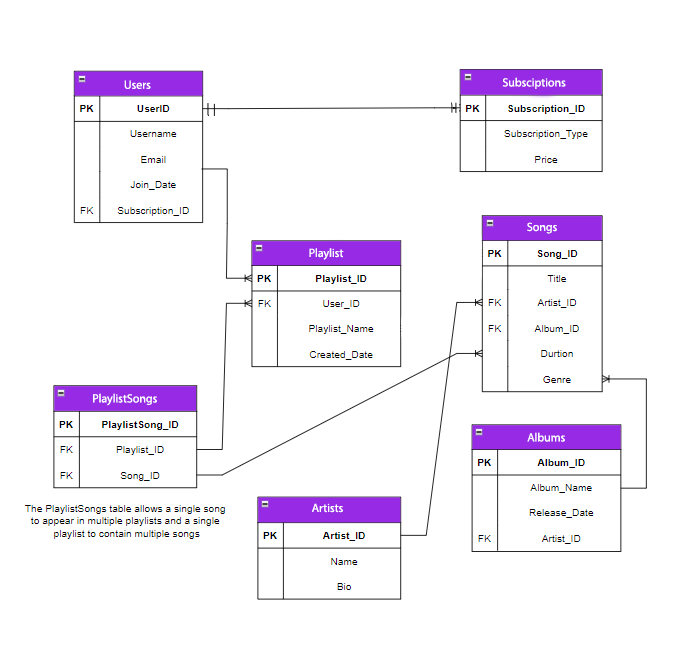

# Tunify Platform


## Overview

Lab 11 focuses on integrating your database tables into your Tunify Platform web application. This lab guides you through setting up the database with Entity Framework Core, creating migrations, defining models, and seeding initial data.

## Entity-Relationship Diagram (ERD)




## Instructions

### Application Setup

1. **Initial Configuration**
   - Create a new Empty .NET Core Web Application.
   - Install the following NuGet packages:
     - `Microsoft.EntityFrameworkCore.SqlServer v7.0.20`
     - `Microsoft.EntityFrameworkCore.Tools v7.0.20`
     - `Microsoft.VisualStudio.Web.CodeGeneration.Design v7.0.12`
   - Register your `DbContext` in the `ConfigureServices` method of your `Startup` class.
   - Add your connection string to the `appsettings.json` file:
     ```json
     "ConnectionStrings": {
       "DefaultConnection": "Server=(localdb)\\MSSQLLocalDB;Database=TunifyDB;Trusted_Connection=true;TrustServerCertificate=True;MultipleActiveResultSets=true"
     }
     ```

### Defining Models & Setting Up the Database

1. **Create Models**
   - Create a folder named `Models` and add your entity classes as defined in your ERD.
   - Start with a `User` model and define its properties.

2. **Setup DbContext**
   - Create a new folder named `Data` and add a file `TunifyDbContext.cs`.
   - Derive `TunifyDbContext` from `DbContext` and include a constructor that accepts `DbContextOptions<TunifyDbContext>`.

3. **Create Initial Migration**
   - Using the Terminal: `dotnet ef migrations add CreateUsersTable`
   - Using the Package Manager Console: `Add-Migration CreateUsersTable`
   - Apply the migration:
     - Using the Terminal: `dotnet ef database update`
     - Using the Package Manager Console: `Update-Database`
   - Verify the `Users` table creation in your local database.

### Adding More Models

1. **Define Additional Models**
   - Add model classes for `Subscription`, `Playlist`, `Song`, `Artist`, `Album`, and `PlaylistSongs` in the `Models` folder.
   - Define their properties according to your ERD.

2. **Update DbContext**
   - Update `TunifyDbContext` to include `DbSet` properties for the new models:
     ```csharp
     public DbSet<Song> Songs { get; set; }
     ```

3. **Create and Apply Migrations**
   - Create migration for new tables:
     - Using the Terminal: `dotnet ef migrations add CreateMusicTables`
     - Using the Package Manager Console: `Add-Migration CreateMusicTables`
   - Apply the migration:
     - Using the Terminal: `dotnet ef database update`
     - Using the Package Manager Console: `Update-Database`
   - Confirm the new tables are created in the database.

### Seeding Initial Data

1. **Seed Data**
   - Override `OnModelCreating` in `TunifyDbContext` to seed initial data for `User`, `Song`, and `Playlist`:
     ```csharp
     protected override void OnModelCreating(ModelBuilder modelBuilder)
     {
         modelBuilder.Entity<User>().HasData(
             // Seeded Data
         );
     }
     ```

2. **Create and Apply Seed Data Migration**
   - Create a migration for seed data:
     - Using the Terminal: `dotnet ef migrations add SeedInitialData`
     - Using the Package Manager Console: `Add-Migration SeedInitialData`
   - Apply the migration:
     - Using the Terminal: `dotnet ef database update`
     - Using the Package Manager Console: `Update-Database`
   - Confirm the initial data is seeded.

## Final Steps

- Ensure your database and models are set up correctly and seeded with initial data.
- Update this `README.md` file with:
  - A brief description of the Tunify Platform.
  - The Tunify ERD Diagram.
  - An overview of the relationships and how each entity is related to another.


  # Lab 12: Tunify Platform - Repository Integration

## Overview

This lab extends the previous Tunify Platform lab by integrating the Repository Design Pattern. You'll learn to create repositories that encapsulate data access logic, making your application more modular and testable.

## Repository Design Pattern

The Repository Design Pattern is a design pattern that provides a way to manage data access and persistence logic in an application. By using repositories, you can separate concerns, making your application more modular, testable, and easier to maintain.

### Benefits of the Repository Design Pattern:
- **Separation of Concerns:** Repositories abstract away the details of data access, allowing your application logic to focus on business rules rather than how data is retrieved or stored.
- **Testability:** By using repositories, you can easily mock data access methods for unit testing, ensuring that your tests are isolated from the database.
- **Maintainability:** Repositories centralize data access logic, making it easier to manage and update without affecting other parts of the application.

## Application Setup

### Initial Configuration (If not completed in the previous lab)
- Install the necessary NuGet packages:
  - `Microsoft.EntityFrameworkCore.SqlServer v7.0.20`
  - `Microsoft.EntityFrameworkCore.Tools v7.0.20`
  - `Microsoft.VisualStudio.Web.CodeGeneration.Design v7.0.12`
- Ensure your `DbContext` is registered in the `ConfigureServices` method of your `Startup` class.
- Ensure your connection string is set in the `appsettings.json` file.

## Implementing the Repository Pattern

1. **Ensure all tables reflect your ERD:**
   - Verify that all tables from Lab 11 are present with the needed migrations.

2. **Organize Controllers:**
   - Create a new folder named `Controllers` to hold your controller classes for `Users`, `Playlist`, `Song`, and `Artist`.

3. **Define Repository Interfaces:**
   - Create a folder named `Repositories` with subfolders `Interfaces` and `Services`.
   - Define interfaces in the `Repositories/Interfaces` folder, declaring necessary methods for each entity (`Users`, `Playlist`, `Song`, `Artist`), including CRUD operations.

4. **Implement Repository Services:**
   - Implement the service classes in the `Repositories/Services` folder, providing the actual data access logic.

5. **Refactor Controllers:**
   - Refactor your controllers to use the repository pattern by replacing direct `DbContext` calls with repository method calls.
   - Use constructor injection to pass repositories into your controllers.

6. **Register Repositories:**
   - Register the repositories in the `ConfigureServices` method of your `Program.cs` class:
     ```csharp
     builder.Services.AddScoped<IRepository, RelatedService>();
     ```
   - Or use:
     ```csharp
     builder.Services.AddTransient<IRepository, RelatedService>();
     ```

## Final Steps

- Ensure all repositories are implemented correctly and controllers are refactored to use them.
- Update your README.md file with a section on the Repository Pattern and how it improves data access in your application.
